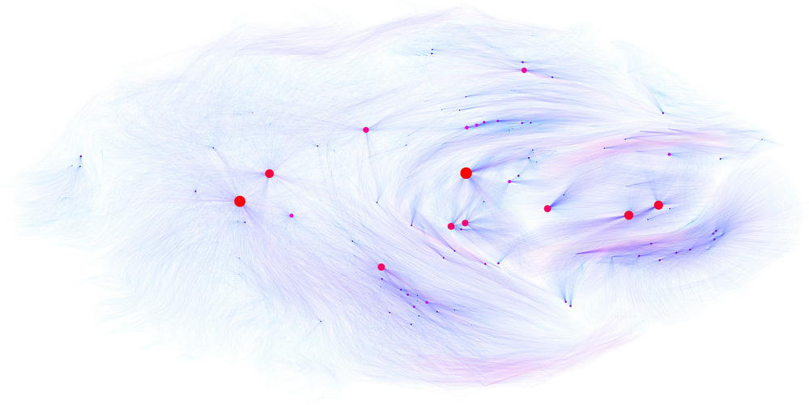

# Tactician's API: A graph- and text-based machine learning interface for Coq


Tactician's API provides external machine learning agents with the data
collected by [Tactician](https://coq-tactician.github.io) from the [Coq Proof
Assistant](https://coq.inria.fr). It is able to extract large-scale datasets
from a wide variety of Coq packages for the purpose of offline machine learning.
Additionally, it allows agents to interact with Coq. Proving servers can be
connected to Tactician's `synth` tactic and prove theorems for Coq users (see
[below](#interaction-with-synth)). Additionally, servers can do proof
exploration through the `Tactician Explore` command (see
[below](#client-based-proof-exploration)).

The data provided to agents includes definitions, theorems, proof terms and a
machine-readable representation of tactical proofs. The data is provided both in
Coq's standard text-based human-readable format and as a semantic graph. The
semantic graph is a single interconnected object that includes the entire
mathematical universe known to Coq (at a given moment in time). The graph is
designed to represent the semantic meaning of a mathematical object as
faithfully as possible, minimizing the amount of implicit knowledge needed to
interpret the object. For example, when a definition `X` refers to another
definition `Y`, such a dependency is encoded explicitly using an edge in the
graph. No definition lookup table is need. We also shy away from using names or
de Bruijn indices as variables. Instead, variables point directly to their
binders, so that name lookup becomes a trivial operation. Such an encoding
reduces alpha-equivalence between terms to the graph-theoretic notion of
bisimilarity, and allows us to globally deduplicate any alpha-equivalent terms
in the graph.

Communication with agents happens through the [Cap'n
Proto](https://capnproto.org) serialization format and remote procedure calling
(RPC) protocol. It supports a wide variety of programming languages, including
Python, OCaml, C++, Haskell, Rust and more. This serialization was chosen
because it allows us to memory-map (`mmap`) large graph datasets, allowing fast
random-access to graphs that may not fit into main memory. Furthermore, Cap'n
Proto's RPC protocol, based on the [distributed
object-capability](https://en.wikipedia.org/wiki/Distributed_object) model,
allows us to export Coq's proof states to external agents. Agents can inspect
the proof states, and execute tactics on them, allowing exploration of the proof
search space in arbitrary order.

## PyTactician library

This repository includes a Python library that provides a layer of abstraction
over Cap'n Proto to make it easier to implement agents in Python. Check its
[README](pytact/README.md) for more information.

## Installation

**Before attempting installation, ensure that you have all
[prerequisites](#prerequisites) installed!**

To install the OCaml component of this repository, make sure that you have the
appropriate switch activated and run the command `opam install .` from the root
of this repository.

If you want maximum performance, it is recommended that you use an OCaml version
with `flambda` enabled. On newer versions of Opam you can achieve this by
installing `ocaml-option-flambda`.

## Usage of the Coq plugin

### Available Commands

These commands will create a graph of some object, and write it to `graph.pdf`
(if `graphviz` is available).

The following commands are always available:
```
[Shared] Graph [Depth <n>] Ident identifier.
[Shared] Graph [Depth <n>] Term term.
```

The normal commands print a fully transitive graph. Adding `Depth i` limits the
traversal to visiting at most `i` nested definitions.

Additionally, in proof mode, these commands are available:
```
[Shared] Graph [Depth <n>] Proof.
```

Options that modify the graphs generated by the commands above are
```
[Set | Unset] Tactician Neural Visualize Ordered.
[Set | Unset] Tactician Neural Visualize Labels.
[Set | Unset] Tactician Neural Visualize Hashes.
```

### Interaction with `synth`
In order to connect Tactician's `synth` tactic to a external tactic prediction
server like the dummy `pytact-server` described above, the plugin makes a number
of commands and settings available in Coq. In order to load the plugin, Coq
needs to be started appropriately. This can be done by prefixing every
invocation of a command that uses Coq, like `coqc`, `coqide`, a `make` command
or an editor like `emacs` with `tactician exec`:

```
tactician exec -- coqc ...
tactician exec -- coqide ...
tactician exec -- make ...
tactician exec -- dune build ...
tactician exec -- emacs ...
```
To make the `synth` command available, your Coq file will have to start with
```
From Tactician Require Import Ltac1.
```
The following settings govern the data that Coq will send to the server:
- `Set Tactician Neural Textmode` determines wether Coq is communicating with a graph-based server or a text-based server (graph-based by default).
- `Set Tactician Neural Metadata` adds text-based metadata to when communicating in graph-mode, such as
  hypothesis names, textual representation of proof states and textual representations of definition.
  This will slow down the communication protocol, and should only be enabled for debugging, or when otherwise needed.
To let Coq take care of starting and stopping the server, use the command
```
Set Tactician Neural Executable "external-server-executable --argument1 --argument2".
```
If you have a prediction server already running somewhere over TCP, you can make Coq connect to it using
```
Set Tactician Neural Server "<address>:<port>".
```
At this point, you have the following commands available which will interact with the server:
- `Tactician Neural Alignment` will ask the which tactics and definitions currently in scope are unknown to it.
  This is meant as a sanity check.
- `Suggest` and `Debug Suggest` will ask the server for predictions for the current proof state.
- `synth` and `debug synth` will perform a proof search by repeatedly asking the server for predictions.
- `Tactician Neural Cache` will preemptively send a lot of required data to the prediction server and keeps that
  information cached. This will make the commands above run much faster. This command can be issued multiple times
  in a document, creating multiple nested caches.
- `Set Tactician Autocache` will automatically execute `Tactician Neural Cache` on each command. This is an
  experimental option, and there may be some overhead associated with this.

## Client-based proof exploration

Finally, the command `Explore.` will initiate a proof exploration session. An example of this is available in
[TestReinforceStdin.v](pytact/tests/TestReinforceStdin.v).
To do this, you need to have a python client running. An example is available in the `pytact-prover` executable.
To see how it works, run
```
pytact-prover --pdfsequence --pdfname test
```
This will execute a dummy proof through the proof exploration interface. Visualizations of each proof state
are available in `test<n>.pdf`.
optionally `--file` option to point to a source Coq `.v` file.
Also with `--interactive` option the innteractive shell appears where you can
manually interact with the environment. Whenever a tactic is executed,
the resulting proof state if visualized in the file
`python_graph.pdf`.

## Generating a dataset
To generate a dataset, you currently have to install a slightly different version of the Coq plugin that resides
in the `generate-dataset` branch. The procedure to generate the dataset is as follows.

1. Create your switch
```
opam switch create tacgen --empty
```
2. Install coq-tactician-api generate-dataset
```
git clone -b generate-dataset --recurse-submodules git@github.com:coq-tactician/coq-tactician-api.git
cd coq-tactician-api
opam install .
tactician inject # you can answer 'no' to recompiling
opam install coq-tactician-stdlib --keep-build-dir # make sure that you have the coq-extra-dev repo enabled
```

3. For your Coq dataset, e.g. `propositional`
```
cd ../propositional
tactician exec dune build
```
4. With opam build of `coq-package` do
```
opam install coq-package --keep-build-dir
```
and you find the `*.bin` in the directory `<switch>/.opam-switch/build`. The recorded
dependency paths are relative to `<switch>/.opam-switch/build`.

## Prerequisites

This repository has an OCaml component that should be installed through the Opam
package manager and a Python component that should be installed through the Pip
package manager. Additionally, some extra dependencies are needed:
- Opam 2.1.x
- Capt'n Proto >= 0.8
- XXHash >= 0.8
- Graphviz
- A reasonable set of development packages like git, bash, gmp, c/c++ compiler
  toolchains that should be installed on most systems.

If your operating systems package manager does not provide these packages with the
correct version, the simplest and most reliable way to install these packages is
through Conda. This repository provides a `environment.yml` file with the required
Conda dependencies. To set it up, follow these commands:
```
git clone --recurse-submodules git@github.com:coq-tactician/coq-tactician-api.git # Clone this repo
cd coq-tactician-api
conda env create -f environment.yml
conda activate tactician
export CPATH="$CONDA_PREFIX:$CPATH" # Needed by cmake to find conda headers
```

On Ubuntu 22.04 or newer, you can get the required packages as follows (older versions of Ubuntu
have to fall back to the Conda solutions because the bundled software is out of date)
```
sudo apt-get --yes install graphviz capnproto libcapnp-dev pkg-config libev-dev libxxhash-dev
```

After installing the prerequisites, you'll need a Python virtualenv and an Opam
switch to install the software. To create the virtualenv, run ``` python -m
venv <desired-location-of-virtualenv> ``` To activate the virtualenv run `source
<location-of-virtualenv>/bin/activate`.

For the OCaml side, if you've never run Opam before, initialize it by running `opam init`. Then, create a switch
with the appropriate software repositories:
```
opam switch create tactician --empty --repos=custom-archive=git+https://github.com/LasseBlaauwbroek/custom-archive.git,coq-extra-dev=https://coq.inria.fr/opam/extra-dev,coq-core-dev=https://coq.inria.fr/opam/core-dev,coq-released=https://coq.inria.fr/opam/released,default
```
Make sure to follow any printed instructions regarding `eval $(opam env)` to activate the switch.


## CI
To verify the build and test locally by specification in `Dockerfile` you run

```
sudo docker build -t test .
```
The `Dockerfile` contains project build instruction and the set of tests.

Our plan for Github Actions CI to always reuse and refer to the same
`Dockerfile`.

In this way we can be sure that local CI is identical to GitHub
Actions CI, and that we can move easily to another platform if
necessary.

## CI caching
The `Dockefile` builds on top of the base layer `Dockerfile_base`
derived from canonical coq-community
`coqorg/coq:8.11.2-ocaml-4.11.2-flambda` that is based on
Debian.10/opam 2.0.9/coq 8.11.2/ocaml-variants-4.11.2+flambda.

The layer defined by `Dockerfile_base` adds `conda/python 3.9`,
`capnp` library and all opam package dependencies requested by the
coq-tactician-api (including the opam package defined in git
submodule `coq-tactician`).

The image defined by `Dockerfile_base` can be updated by maintainers (currently Vasily) by
```
sudo sh ci-update-base.sh
```
This caching update is necessary only periodically and only
for optimisation of the speed of CI, but it is not strictly necessary for CI to perform correctly
(opam is supposed to reinstall packages if dependencies are changed -- to be confirmed by practice).
